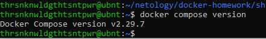
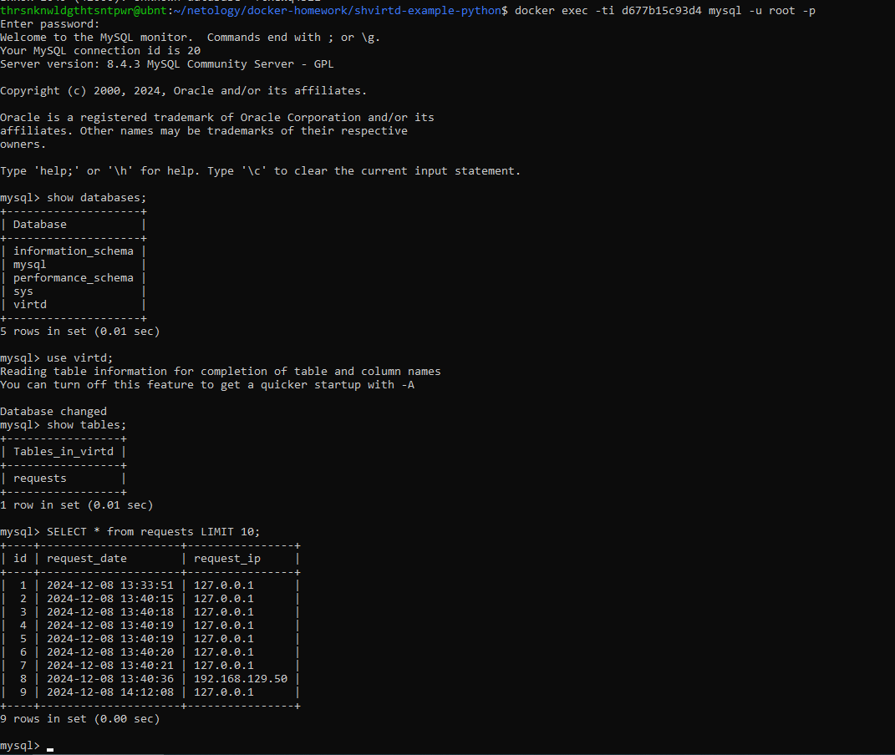
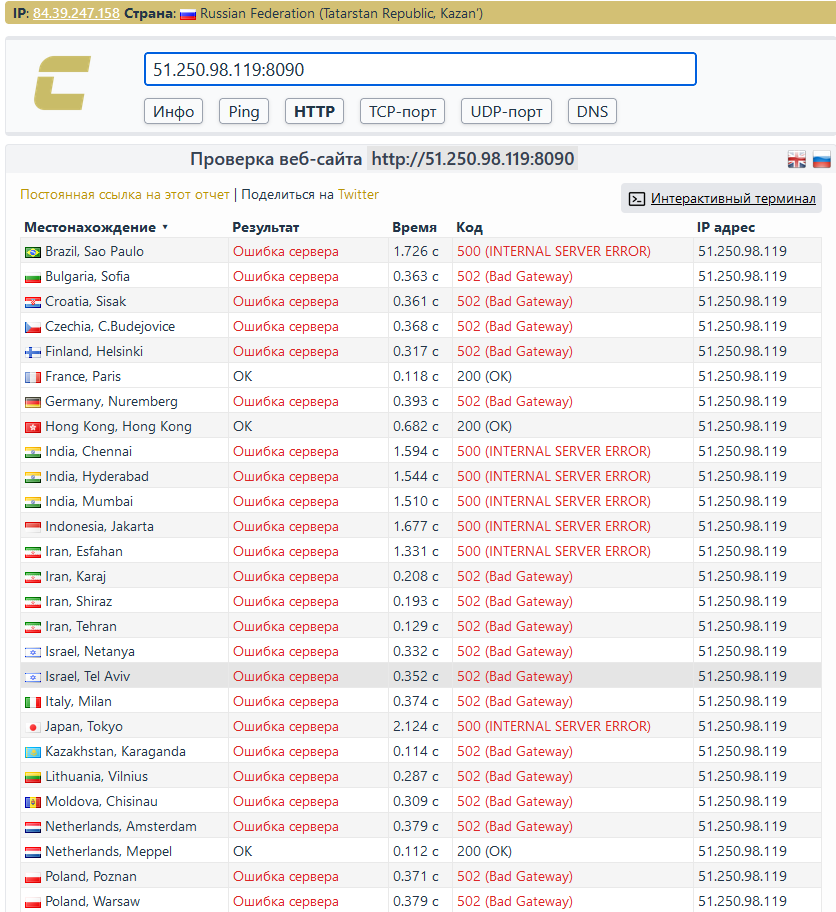
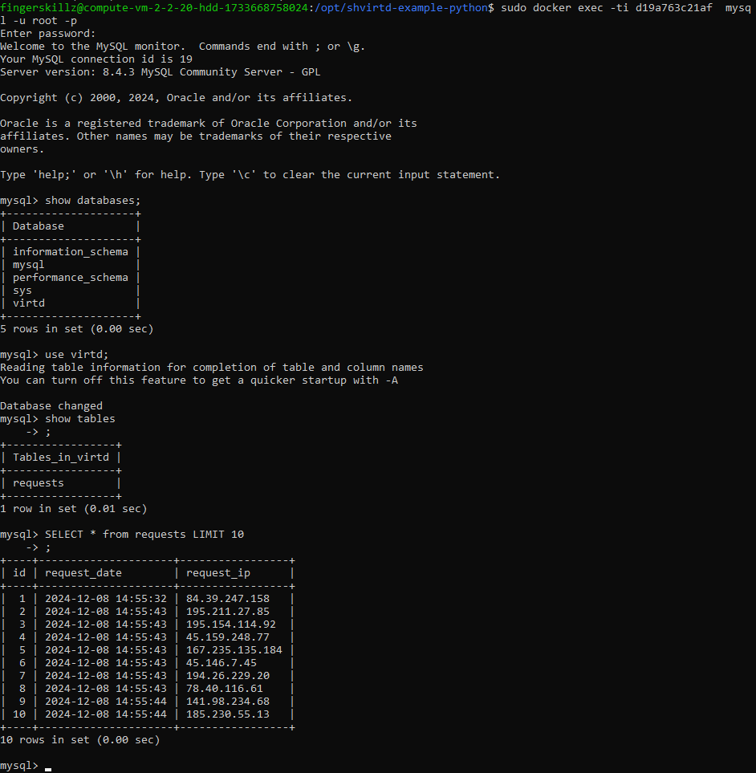
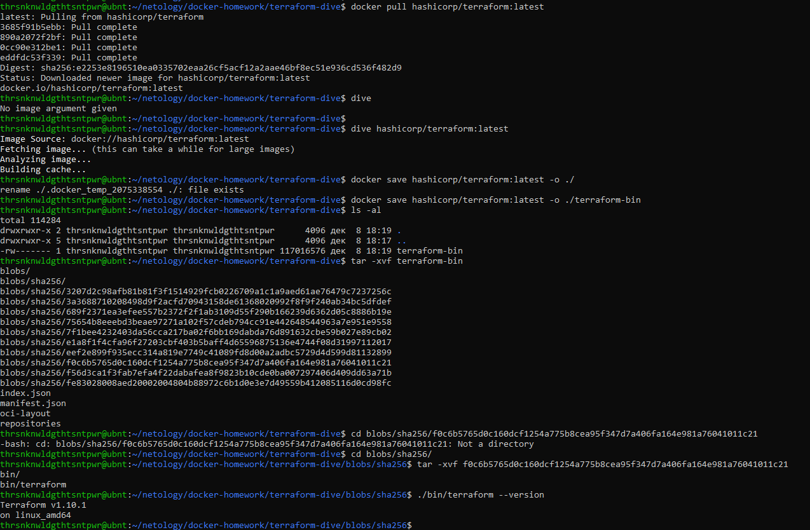
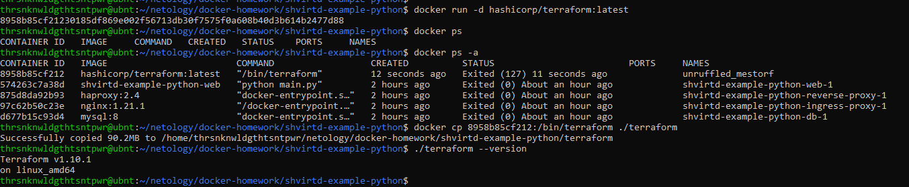

#Домашнее задание к занятию "`Практическое применение Docker`" - `Никифоров Роман`

[Руководство по оформлению Markdown файлов](https://gist.github.com/Jekins/2bf2d0638163f1294637#Code)

---

### Задача 0



### Задача 1


```
$ cat Dockerfile.python
FROM python:3.9-slim

WORKDIR /app

COPY requirements.txt .

RUN pip install -r requirements.txt

COPY main.py .

CMD ["python", "main.py"]
```

Файл .dockerignore добавлять не стал, т.к. внутрь контейнера копируются два файла


### Задача 3



### Задача 4

```
$ cat ~/clone-git.sh
#!/bin/bash
# Add Docker's official GPG key:
sudo apt-get update
sudo apt-get install ca-certificates curl
sudo install -m 0755 -d /etc/apt/keyrings
sudo curl -fsSL https://download.docker.com/linux/ubuntu/gpg -o /etc/apt/keyrings/docker.asc
sudo chmod a+r /etc/apt/keyrings/docker.asc

# Add the repository to Apt sources:
echo \
  "deb [arch=$(dpkg --print-architecture) signed-by=/etc/apt/keyrings/docker.asc] https://download.docker.com/linux/ubuntu \
  $(. /etc/os-release && echo "$VERSION_CODENAME") stable" | \
  sudo tee /etc/apt/sources.list.d/docker.list > /dev/null
sudo apt-get update && sudo apt-get install docker-ce docker-ce-cli containerd.io docker-buildx-plugin docker-compose-plugin git -y

cd /opt

sudo git clone https://github.com/thrsnknwldgthtsntpwr/shvirtd-example-python.git

cd shvirtd-example-python

sudo docker compose up -d
```





### Задача 6




### Задача 6.1

